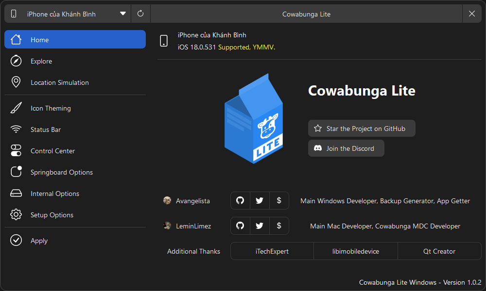
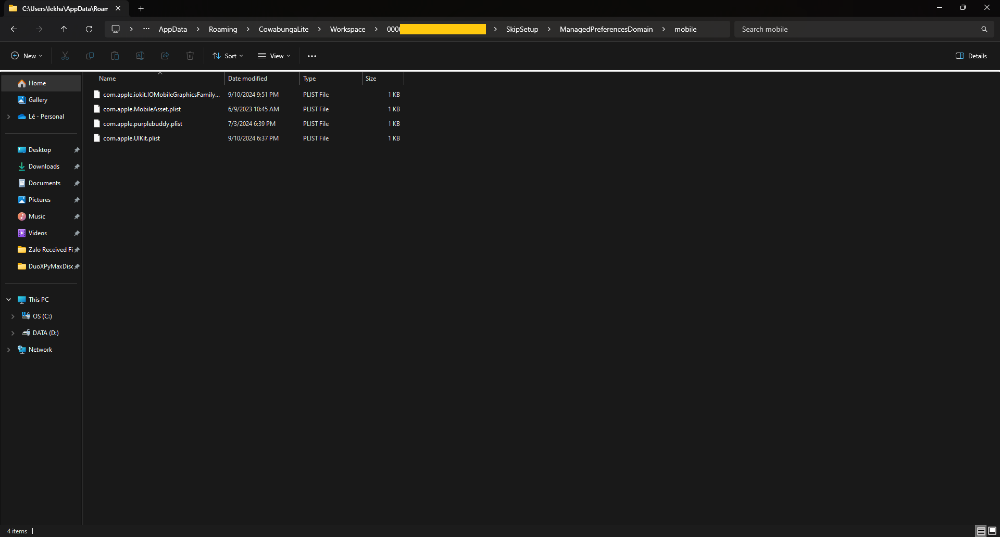
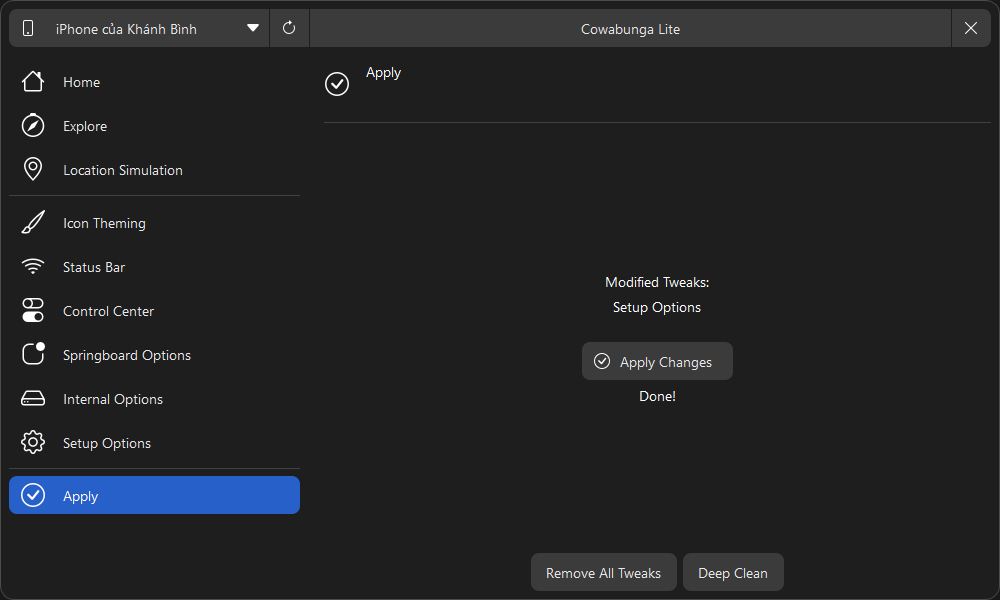

# FixRDAR4XR11
Fix RDAR issue when Dynamic Island is enabled on iPhone XR/11, 17.0 to 18.0 RC1

### Pro (compared to MDC/KFD method)
- This is applied permanently (does not disappear after a reboot or respring)

### Cons
- Some UI may bug out after the resolution changes (the plist we provided here comes with an `optimized` resolution for XR/11, so everything should work fine)
- 50/50 chance of a boot loop if something is done incorrectly

## For Windows
1. Download [Cowabunga Lite for Windows](https://github.com/Avangelista/CowabungaLiteWindows)
2. Download the plist file from [Releases](https://github.com/HorizonUnix/FixRDAR4XR11/releases)
3. Open Cowabunga Lite for Windows and connect your iPhone to your PC

4. Navigate to `C:\Users\xxx\AppData\Roaming\CowabungaLite\Workspace\000-YOUR-DEVICE-UUID\SkipSetup\ManagedPreferencesDomain\mobile`
5. Paste the plist you just downloaded into the `mobile` folder

6. Go back to Cowabunga Lite, click the Apply tab, and then press the Apply button, the device will reboot after that
7. After applying the resolution, use [MisakaX](https://github.com/straight-tamago/misakaX) or Nugget to enable Dynamic Island (2796)

## For macOS
### COMING SOON

## Special thanks to 💖

- [straight-tamago](https://x.com/straight_tamago) and [Little_34306](https://x.com/Little_34306) for [MisakaX](https://github.com/straight-tamago/misakaX)
- [leminlimez](https://x.com/leminlimez) for Nugget
- [sourcelocation](https://github.com/sourcelocation/) - [ResSet16](https://github.com/sourcelocation/ResSet16) for plist file idea
- [iTechExpert21](https://x.com/iTechExpert21) for backup idea

