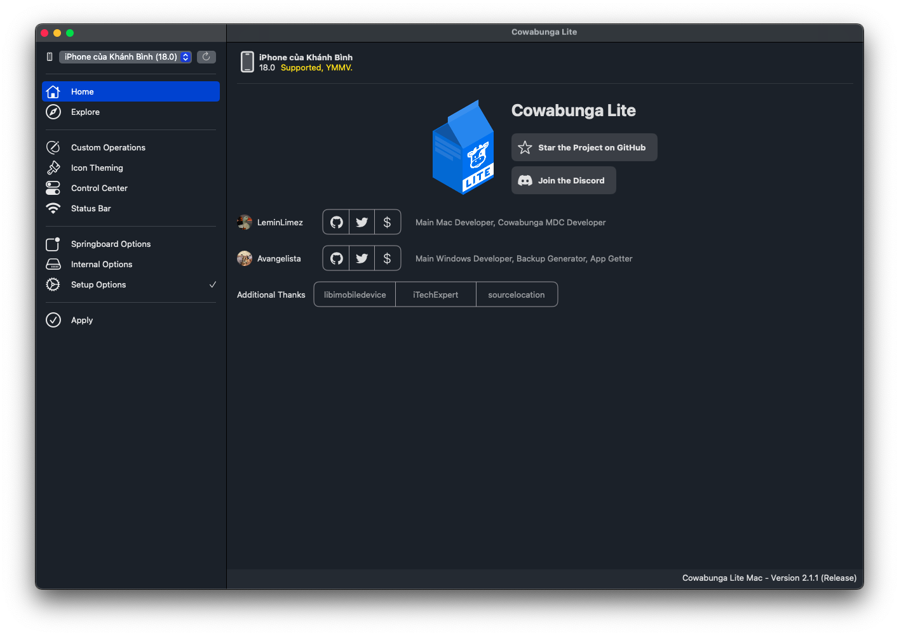
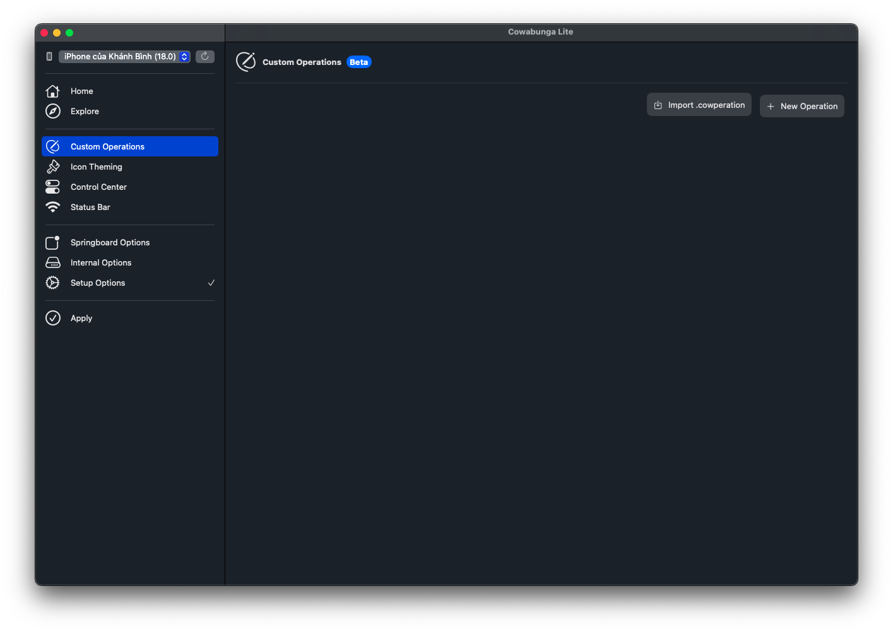
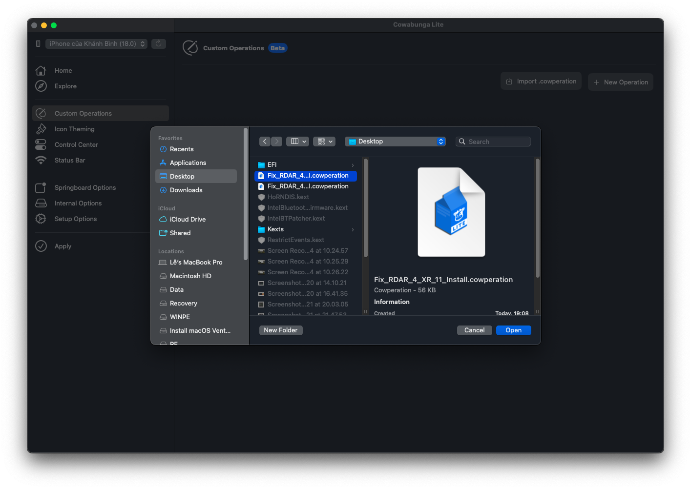
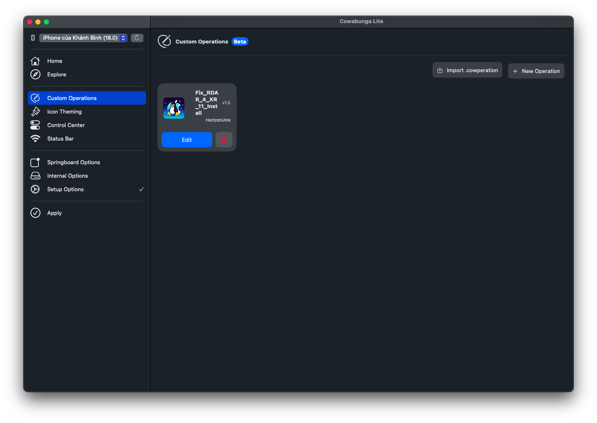
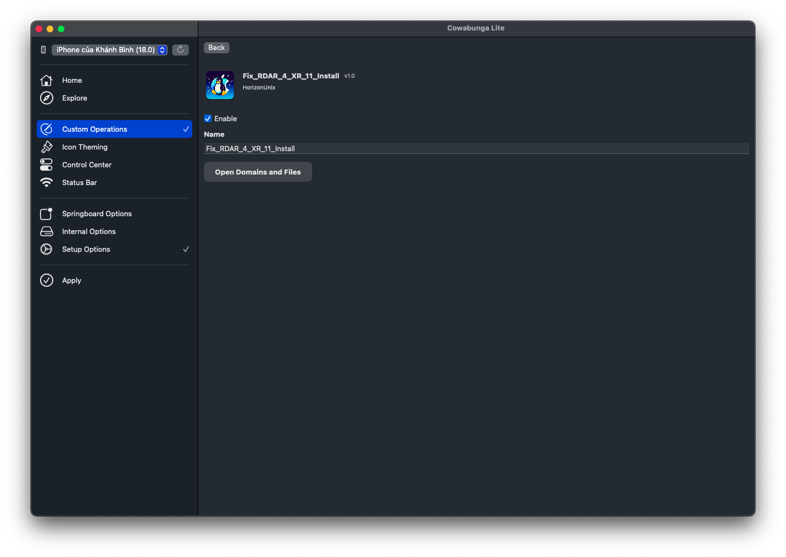
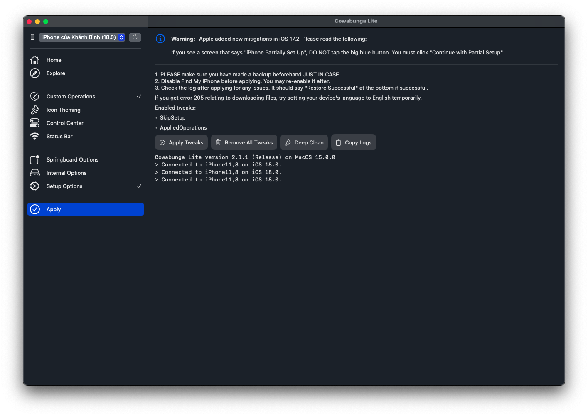
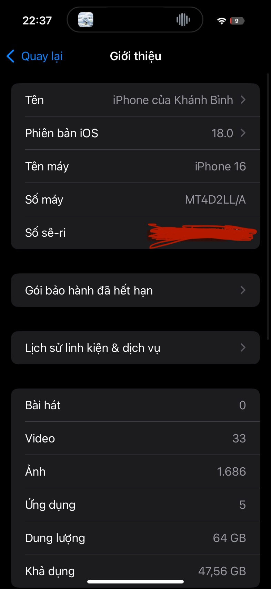
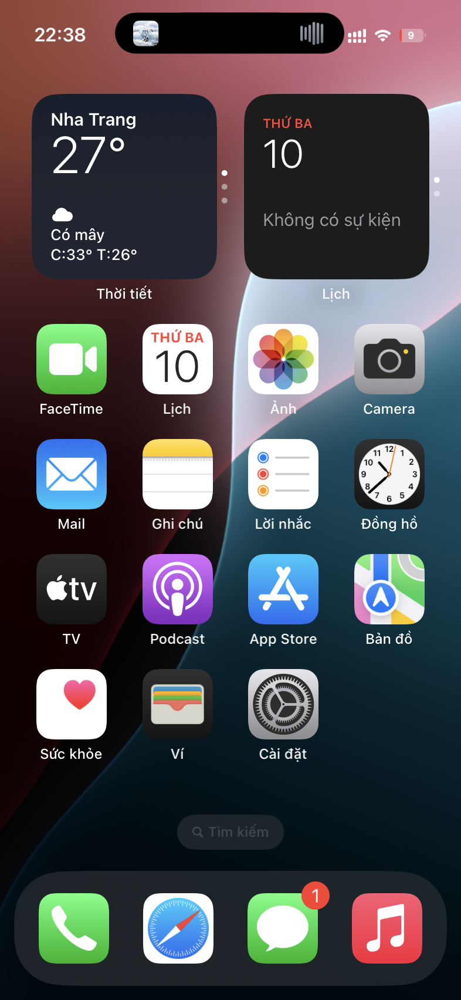

# FixRDAR4XR11
Fix RDAR issue when Dynamic Island is enabled on iPhone XR/11, from iOS 17.0 to 18.0.1 / Beta 4

### Pros (compared to MDC/KFD method)
- This is applied permanently (does not disappear after a reboot or respring).

### Cons
- Some UI elements may bug out after the resolution changes (the plist provided here comes with an `optimized` resolution for XR/11, so everything should work fine).
- You have to reapply this fix after an OS update.
- 50/50 chance of a boot loop if something is done incorrectly.

# Install
### For Windows
1. Download [Cowabunga Lite for Windows](https://github.com/Avangelista/CowabungaLiteWindows).
2. Download the plist file from [Releases](https://github.com/HorizonUnix/FixRDAR4XR11/releases).
3. Open Cowabunga Lite for Windows and connect your iPhone to your PC.

4. Navigate to `C:\Users\xxx\AppData\Roaming\CowabungaLite\Workspace\000-YOUR-DEVICE-UUID\SkipSetup\ManagedPreferencesDomain\mobile`.
5. Paste the plist you just downloaded into the `mobile` folder.

6. Go back to Cowabunga Lite, click the Apply tab, and then press the Apply button. The device will reboot after that.

### For macOS
1. Download [Cowabunga Lite v2.1.1](https://github.com/HorizonUnix/FixRDAR4XR11/releases).
2. Download the install `.cowperation` file from [Releases](https://github.com/HorizonUnix/FixRDAR4XR11/releases).
3. Open Cowabunga Lite for macOS and connect your iPhone to your Mac.

4. Click the `Custom Operations` tab and then click the `Import` button.

5. Choose the install file.

6. After importing the install file, click the `Edit` button.

7. Then click the `Enable` button and then click the `Back` button.

8. Click the `Apply` tab and click the `Apply` button.

# Uninstall
### For Windows

1. Download the uninstall plist file from [Releases](https://github.com/HorizonUnix/FixRDAR4XR11/releases), rename it like the install file, and follow the same steps above.

### For macOS

1. Download the uninstall `.cowperation` file from [Releases](https://github.com/HorizonUnix/FixRDAR4XR11/releases) and follow the same steps above.

# Screenshot

## Special thanks 💖

- [straight-tamago](https://x.com/straight_tamago) and [Little_34306](https://x.com/Little_34306) for [MisakaX](https://github.com/straight-tamago/misakaX).
- [leminlimez](https://x.com/leminlimez) for Nugget and Cowabunga Lite.
- [sourcelocation](https://github.com/sourcelocation/) - [ResSet16](https://github.com/sourcelocation/ResSet16) for the plist file idea.
- [iTechExpert21](https://x.com/iTechExpert21) for the backup idea.
